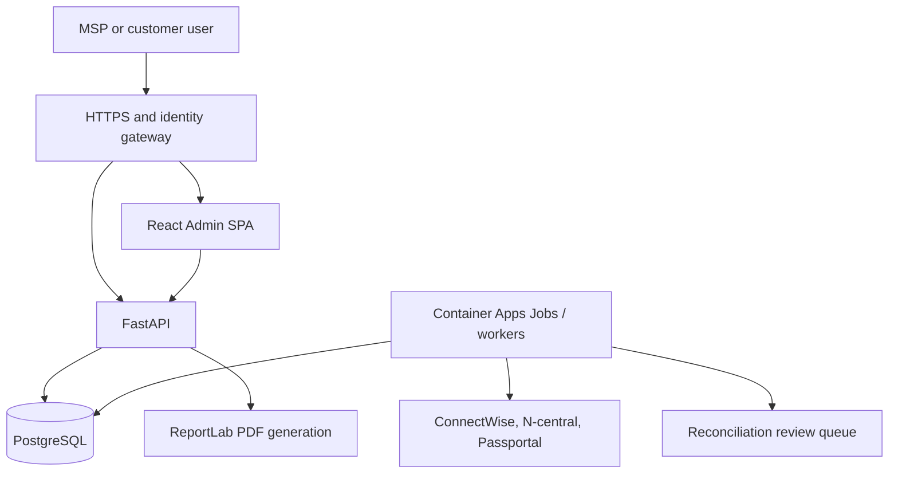

# Architecture

IPT CMDB is a tenant-aware web platform with a React single-page application, a FastAPI service and PostgreSQL as the canonical operational store.

## Runtime components



The current Docker image contains the compiled SPA and API. This keeps local hosting simple while preserving a clean browser/API boundary. The browser never receives a database connection string or provider secret.

## Frontend

The frontend uses:

- React and TypeScript;
- React Admin for resource routing and authenticated application structure;
- Material UI for components and theming;
- React Flow and ELK for interactive topology and automatic layout.

The workspace selector is the tenant boundary in the user experience. Root users can select the MSP workspace or an authorised customer. Customer users are constrained to their assigned tenant. A workspace change triggers a new API-scoped load; cached data from the previous customer is not reused as authority.

Major UI areas are:

- MSP and customer operational dashboards;
- relationship-aware asset inventory and detail views;
- business-system catalogue;
- layered dependency and impact maps;
- change-control workflow and PDF output;
- root customer, access, integration, branding and database administration.

## API and authorization

FastAPI owns all public routes, authentication resolution, tenant authorization, validation and audit-producing writes. Pydantic request models validate mutation inputs. Every operational entity is evaluated against the current user's allowed `companyId` set.

Request middleware assigns request and correlation identifiers, returns them to callers and makes them available to repository audit writes. Diagnostic request logs remain separate from the append-only governance ledger.

Roles currently exposed by the application are:

| Role | Intended scope |
|---|---|
| `platform_admin` | All customers and platform configuration |
| `msp_operator` | Assigned customers and MSP operational tools |
| `client_reader` | One customer workspace; read-only operational access |

UI visibility is not a security control. API routes independently enforce platform role, customer access and management permission.

## Authentication modes

`AUTH_MODE` selects one of two supported boundaries:

- `local` uses salted PBKDF2-SHA256 password hashes, PostgreSQL-backed hashed sessions and optional or policy-required RFC 6238 TOTP.
- `easy_auth` trusts identity headers injected by an authenticated Azure Container Apps/App Service gateway and maps the resulting email to a persisted CMDB user.
- restricted personal API tokens authenticate automation against an explicit resource allow-list, read/write scopes and an optional customer subset. Only token hashes are persisted, and platform administration is never available through this channel.

Easy Auth header names, email-claim precedence, login URL and logout URL are runtime configurable. Password login is disabled in Easy Auth mode unless `ALLOW_LOCAL_BREAK_GLASS=true` is explicitly enabled.

Local MFA is a two-stage transaction. Password verification creates a five-minute, hashed database challenge rather than a browser session. Enabled users must prove a non-replayed TOTP step or redeem a one-use recovery code; policy-required users without a factor are taken through QR enrollment and receive recovery codes once. Only then is the hashed PostgreSQL session created. Entra identities remain governed by Entra Conditional Access and are not double-prompted by the application.

The API continues to enforce tenant and role authorization after external authentication. A valid Entra identity without a corresponding CMDB user assignment does not receive platform access.

## PostgreSQL and migrations

PostgreSQL is the production source of truth. The repository stores customers, users, access groups, CIs, identifiers, relationships, integration connections, mappings, observations, changes, branding, sync runs, reconciliation candidates, data-quality exceptions, field-authority rules and audit events in normalized tables.

Audit rows are append-only and contain sanitised before/after values, field changes, actor attribution, source, outcome and correlation context. Tenant-aware reporting is assembled through controlled report templates rather than allowing arbitrary SQL from the web tier.

At startup the application:

1. connects using `DATABASE_URL`;
2. obtains a PostgreSQL advisory migration lock;
3. verifies the recorded migration history is an exact prefix of the packaged history;
4. checks immutable migration checksums;
5. applies pending migrations in order;
6. bootstraps operational data according to `DATABASE_SEED_MODE` when the database is blank.

The application fails closed when a configured PostgreSQL database is unavailable or incompatible. It does not silently fall back to JSON customer data.

Without `DATABASE_URL`, the default surface is a constrained first-start database setup experience. The lightweight local repository is available only with `ALLOW_LOCAL_DEVELOPMENT=true` and must not be enabled in production.

## Canonical identity and reconciliation

`configuration_items.id` is the stable canonical UUID referenced by relationships, ownership, change snapshots and audit events. It must not change when a provider renames an object.

`external_object_mappings` binds a canonical entity to:

- an integration connection;
- a provider object type;
- the provider's stable external ID;
- the latest provider-visible name and metadata.

Matching follows this order:

1. existing connection/object/external-ID mapping;
2. one verified strong identifier such as serial, device UUID or SID;
3. a reconciliation candidate for human review;
4. a new canonical CI only when no safe match exists.

Names, IP addresses and mutable descriptions are evidence, not identity. `ci_field_authority` determines which source can update a canonical field. Lower-authority observations remain visible without silently overwriting the authoritative value.

The Data Quality Center calculates deterministic findings from canonical CIs and relationships at read time. This allows rule improvements without rebuilding a findings table. Deliberately accepted conditions are stored as scoped, expiring `data_quality_exceptions` rows with mandatory reasons. Reconciliation decisions and authority changes are persisted and audited but do not perform provider writes.

## Relationship and impact model

Relationships are directed records with an `impactPolicy`:

- `required` propagates outage impact;
- `degraded` propagates degraded service;
- `redundant` represents a protected path when evidence supports it;
- `informational` is visible but excluded from impact traversal.

The visual perspectives use one canonical graph. Full-stack lanes group foundation, network, storage, virtualization, compute, application/data and business-system CIs. Business-system filters traverse supporting dependencies so a customer-facing service can expose the underlying network, storage, compute and software stack.

Virtualization impact uses recorded HA, cluster membership, host health, minimum-host capacity, mobility and protection evidence. It is an operational planning aid, not a replacement for live hypervisor admission-control data.

## Change-control snapshots

Change packages reference live scope CIs during preparation. When saved, the package freezes impacted CI names, paths, ownership, business systems, risk factors and technical plans. Later CI edits therefore do not rewrite historical evidence.

The provider-neutral external-link envelope reserves future ConnectWise ticket state. Publishing must be explicit and idempotent; the current application does not create ConnectWise tickets.

## Integration execution boundary

The web API currently exposes integration configuration/status and safe connectivity checks. Production ingestion should run in a separate worker or Azure Container Apps Job so long-running provider calls, retries and rate limits do not consume web requests.

Workers should follow:

```text
collect -> normalize -> identify/match -> preview/reconcile -> apply -> audit
```

Provider credentials belong in Azure Key Vault or equivalent secret injection. Integration rows store a credential reference or environment-backed state, never the secret value.

## Recovery boundary

Portable export/import is for moving supported operational records between installations. It is checksum protected and previewed before merge, but it is not a database backup.

Production recovery relies on Azure Database for PostgreSQL point-in-time restore or independently scheduled and tested `pg_dump`/`pg_restore`. See [docs/OPERATIONS.md](docs/OPERATIONS.md).
